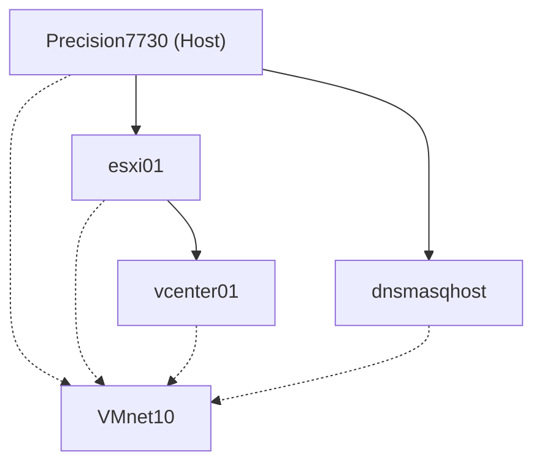

```mermaid
graph TD
    Host["Precision7730 (Host)"]

    Host -.-> VMNet["VMnet10"]
    Host --> ESXi["esxi01"]
    Host --> DNS["dnsmasqhost"]

    ESXi -.-> VMNet
    DNS -.-> VMNet

    ESXi --> VC["vcenter01"]
    VC -.-> VMNet

```
