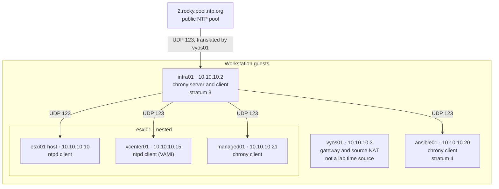

# NTP Hierarchy

How time reaches every node in Range Lab. Arrows point from a time source to its client. Decisions:
[ADR-0004](Decision%20Records/ADR-0004%20-%20Lab%20time%20source.md), revised by
[ADR-0006](Decision%20Records/ADR-0006%20-%20Infrastructure%20services%20outside%20the%20hypervisor.md)
and [ADR-0007](Decision%20Records/ADR-0007%20-%20Internet%20access%20through%20vyos01.md).

Nodes inside esxi01 are configured as their stages build them.

---

## Nodes

| Node | Runs on | Software | Syncs from | Serves | Key settings |
| ---- | ------- | -------- | ---------- | ------ | ------------ |
| [[infra01]] | VMware Workstation | chrony | public pool, through [[vyos01]] | `10.10.10.0/24` | `allow 10.10.10.0/24`, `makestep 1.0 -1` |
| [[ansible01]] | VMware Workstation | chrony | `10.10.10.2` | - | `makestep 1.0 -1` |
| [[esxi01]] | VMware Workstation | ntpd | `10.10.10.2` | - | runs with `-g`, one startup correction only |
| [[vcenter01]] | [[esxi01]] | ntpd (VAMI) | `10.10.10.2` | - | - |
| [[managed01]] | [[esxi01]] | chrony | `10.10.10.2` | - | `makestep 1.0 -1` |

A client is one stratum below its source. Strata move with the upstream the pool selects.

---

## Why it is shaped this way

- **The time source sits outside the hypervisor.** Suspending [[esxi01]] freezes the VMs inside it.
  When the lab's clock lived there, a suspend split the lab by 3 h 49 m. infra01 runs beside esxi01
  in Workstation, so hypervisor state cannot stop the lab's clock.
- **The upstream is real.** The pre-rebuild lab had no reachable time source and invented
  `local stratum 10`, which guaranteed only that nodes agreed with each other. Internet access
  through [[vyos01]] removed the need for that.
- **Clients point at an address, not a name.** Time does not depend on DNS, so a DNS fault cannot
  also become a time fault.
- **The Windows host is not involved.** It was the upstream between 2026-09-15 and the rebuild;
  its NTP server setting and the VMnet10 firewall rule are no longer used by the lab.

---

## Checking it

| Where | Command | Healthy |
| ----- | ------- | ------- |
| Any chrony node | `chronyc sources` | `^*` on the configured source |
| [[infra01]] | `chronyc clients` | Each lab node listed with a non-zero packet count |
| [[esxi01]], [[vcenter01]] | `ntpq -p` | `*` on `10.10.10.2` |

---

## Related

- [[chrony]]
- [[infra01]]
- [[vyos01]]
- [[ansible01]]
- [[esxi01]]
- [[Build-Sequence]]
- [[Known-Issues]]
