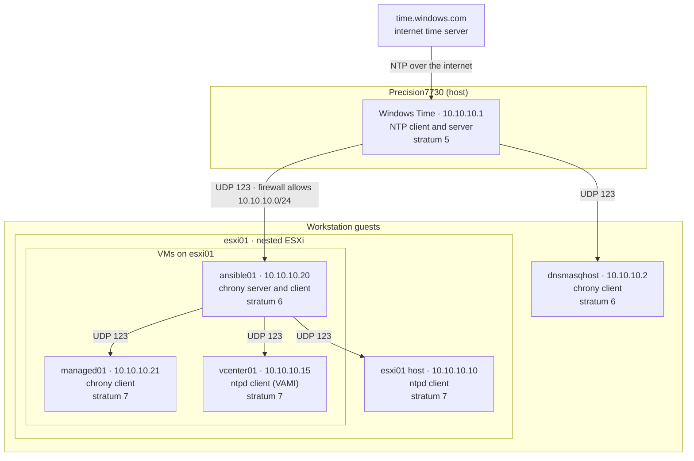

# NTP Hierarchy

> **Pre-rebuild content.** Describes the lab as built before 2026-09-16, including the
> `rangelab.local` domain. Rewritten when Stage 3 of [[Build-Sequence]] rebuilds it.

How time reaches every node in Range Lab. Arrows point from a time source to its client. Boxes
show where each node runs. Decision and rationale:
[ADR-0004](Decision%20Records/ADR-0004%20-%20Lab%20time%20source.md).

---

## Nodes

| Node | Runs on | Software | Syncs from | Serves | Key settings | Stratum |
| ---- | ------- | -------- | ---------- | ------ | ------------ | ------- |
| [[Precision7730]] | physical host | Windows Time | `time.windows.com` | VMnet10 | `NtpServer` enabled, `AnnounceFlags 5`, poll interval 6–10 | 5 |
| [[ansible01]] | [[esxi01]] | chrony | `10.10.10.1` | `10.10.10.0/24` | `makestep 1.0 -1`, `allow 10.10.10.0/24` | 6 |
| [[dnsmasqhost]] | VMware Workstation | chrony | `10.10.10.1` | - | `makestep 1.0 -1` | 6 |
| [[managed01]] | [[esxi01]] | chrony | `ansible01.rangelab.local` | - | `makestep 1.0 -1` | 7 |
| [[vcenter01]] | [[esxi01]] | ntpd (VAMI timesync: NTP) | `ansible01.rangelab.local` | - | `tinker panic 0` | 7\* |
| [[esxi01]] | VMware Workstation | ntpd | `ansible01.rangelab.local` | - | runs with `-g` | 7\* |

Strata marked \* weren't read directly. A client is always one stratum below its source, so they
follow from ansible01's stratum 6. The other strata were read with `chronyc` on 2026-09-15. Strata
can change if the upstream changes.

---

## Why it's shaped this way

- **One source with internet access.** Precision7730 is the only machine that can reach the
  internet, and every VM runs on it, so it's up whenever the lab is.
- **dnsmasqhost bypasses ansible01.** It runs beside esxi01 in Workstation. When esxi01 is
  suspended, ansible01's clock freezes, and a client following it gets dragged backward. Taking
  time straight from the host avoids that.
- **esxi01 takes time from a VM it hosts.** At boot, ansible01 isn't running yet, so esxi01 keeps
  the time from its virtual hardware clock, which Workstation sets from the host. Autostart then
  starts ansible01 first, and ntpd syncs to it once it's up.
- **Single point of failure.** If Windows Time stops on Precision7730, nothing corrects the lab,
  and its clocks drift together.

---

## Checking it

| Where | Command | Healthy |
| ----- | ------- | ------- |
| Precision7730 | `w32tm /query /status` | `Source: time.windows.com,0x8` |
| ansible01, dnsmasqhost, managed01 | `chronyc sources` | `^*` on the configured source |
| vcenter01, esxi01 | `ntpq -p` | `*` on `ansible01` |

---

## Related

- [[chrony]]
- [[Precision7730]]
- [[ansible01]]
- [[dnsmasqhost]]
- [[managed01]]
- [[vcenter01]]
- [[esxi01]]
- [[VM Layout]]
- [[Known-Issues]]
