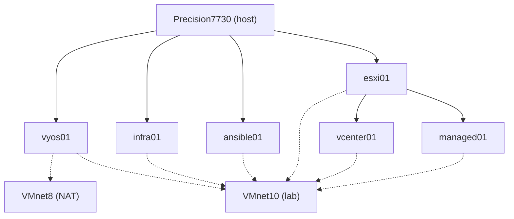

# VM Layout

Where each node runs and which networks it attaches to. Solid arrows mean "runs on"; dashed lines
are network attachments. Addresses are in [[IP Index]]; sizing is in each device note.

vyos01, infra01, and ansible01 run directly in Workstation so the lab's gateway, DNS, time, and
Ansible control node do not depend on esxi01 (ADR-0006). vcenter01 and managed01 reach VMnet10
through esxi01's [[VM Network]] port group.

---

## Related

- [[IP Index]]
- [[VMnet10]]
- [[VMnet8]]
- [[VM Network]]
- [[Rebuild-Plan]]
