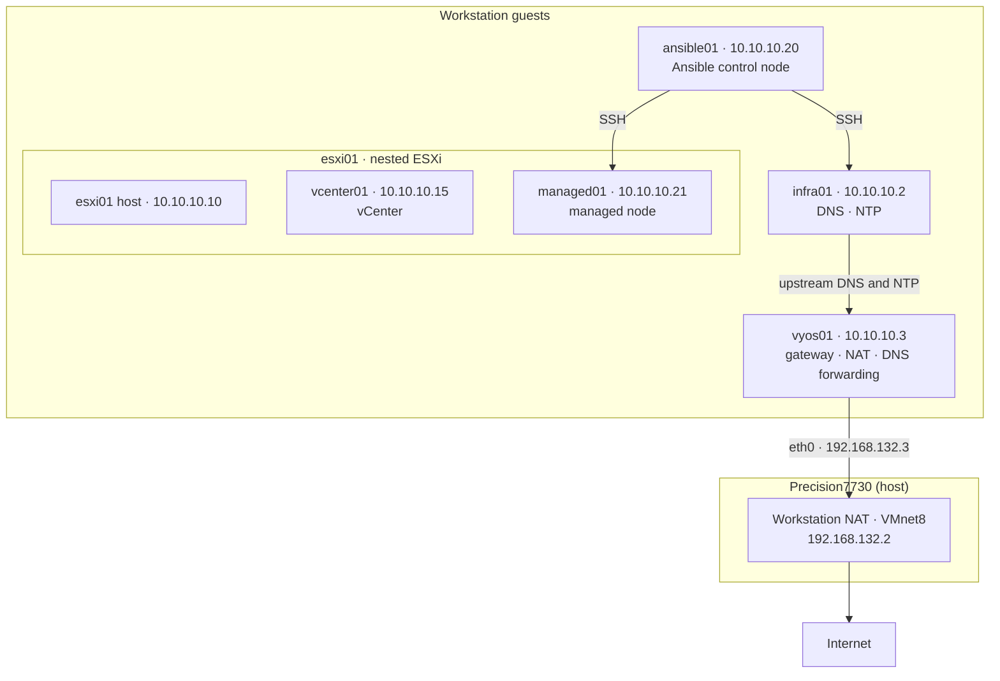

# Rebuild Plan

**Status:** version 2, 2026-09-15. Re-scoped to the [[Project_Checklist]] and Isaac's decisions.
Nothing has been built yet. Tracked in Linear project **RangeLab Rebuild** (target 2026-09-17).

**Purpose:** Phase 6 needs a build sequence another person could follow. Today's lab works, but it
got there through hand fixes, clones, and workarounds that a build sequence would carry forward.
This plan rebuilds the lab from scratch with those problems designed out, and writes
`Build-Sequence.md` from the real build as it happens.

---

## 1. Goal and definition of done

**By the deadline (2026-09-17, about 8 of Isaac's hours):**

1. A full, successful build of the layout in §4.
2. `Build-Sequence.md` written during the build, step by step, from what actually worked.
3. Every stage's checks (§6) pass, and a second `site.yml` run reports `changed=0`.
4. No workarounds and no cloned VMs.
5. Isaac can explain every step and every tool.

**After the deadline:** a second build that follows the doc with zero deviations, an outside
reviewer, the `v1.0` tag, and a VyOS firewall policy.

---

## 2. Rules for this build

- **Stay on the checklist.** Anything beyond [[Project_Checklist]] is a named, small expansion. The
  only one is vyos01 as a minimal gateway (roadmap Stage 01, `.3` already reserved in ADR-0001).
- **Only tools Isaac understands.** Anything new gets explained before it's used.
- **Right the first time.** Values and commands are prepared and checked before each stage. Each
  stage starts with pre-flight checks for what it depends on.
- **Time-box problems to 20 minutes.** If a problem isn't understood by then, stop, choose the
  known-good path, and record it.
- **Document in the moment.** The build doc is updated as each step succeeds, not afterward.
- **No clones, no undocumented hand edits.**

---

## 3. What the rebuild fixes

From the journals, [[Troubleshooting]], and [[Known-Issues]].

| Problem last time | Cause | Rebuild |
|---|---|---|
| DNS outage at boot (09-05) | `bind-interfaces` race | `bind-dynamic` in the Ansible-managed dnsmasq config |
| AAAA answered NXDOMAIN; vCenter couldn't add esxi01 | `address=` rules instead of host records | One `host-record` per host, generated from the inventory |
| DNS records edited by hand | No single source of truth | Records generated from `Ansible/inventory` |
| `.local` domain | Reserved for multicast DNS (RFC 6762) | `rangelab.internal` (reserved for private use, 2024) |
| Lab clocks 3 h 49 m apart | Time server had no upstream, nested in esxi01 | infra01 (outside esxi01) syncs from internet NTP through vyos01; everything else syncs from infra01 |
| Linux guest booted 5 h off | Workstation virtual clock set to local time | `rtc.diffFromUTC = "0"` in each Rocky VM's configuration |
| esxi01 certificate issued to `localhost.localdomain` | Certificate made before the FQDN was set | Set the FQDN, regenerate certificates, check the SAN before adding the host |
| vCenter deployed with temporary gateway and DNS | DNS and a gateway didn't exist yet | vyos01 and infra01 come first; vCenter gets final values |
| vcenter01 CPU-starved | Tiny size (2 vCPU) | `small` size (4 vCPU, 21 GB) |
| 13.75 GB leftover datastore, second disk added later | ESXi 9 system storage fills a 142 GB disk | 128 GB boot disk (no datastore created) plus a separate data disk |
| Autostart never configured | Missed | Configured and checked in the build |
| Rocky mirrors unreachable; ISO repo per VM; fstab missed on managed01 | Air-gapped with no package source | vyos01 gives the lab internet access; nodes use the normal Rocky repos and get updates |
| managed01 cloned: shared machine-id, host keys, hostname, VMX name | Cloning without generalization | Every node is a fresh install |
| `ansible` account and sudo rule created by hand | No bootstrap | `bootstrap.yml` creates them |
| `ansible.posix` and `ansible-lint` unavailable | Air-gapped | Installed normally from Galaxy and pip |
| CRLF file broke journald; `rm -rf` of the working copy | Files copied with `scp` | ansible01 clones the repo from GitHub and uses `git pull` |
| Control node and NTP server nested in the hypervisor | Placement | ansible01 and infra01 run directly in Workstation |
| dnsmasqhost unmanaged, misnamed, built ad hoc | Built before Ansible; no spec | infra01, Ansible-managed, built from a settings table, named per [[Naming Convention]] |

---

## 4. Target architecture

### 4.1 Topology

### 4.2 Nodes

| Node | Runs on | Address | OS | vCPU / RAM / disk | Roles |
|---|---|---|---|---|---|
| vyos01 | Workstation | LAN 10.10.10.3 (VMnet10), WAN 192.168.132.3 (VMnet8) | VyOS Stream 2026.02 (1.5 Circinus) | 1 / 4 GB / 20 GB | Gateway, source NAT, DNS forwarding |
| infra01 | Workstation | 10.10.10.2 | Rocky 10.2, BIOS | 1 / 2 GB / 20 GB | DNS (dnsmasq), NTP server (chrony) |
| ansible01 | Workstation | 10.10.10.20 | Rocky 10.2, BIOS | 2 / 4 GB / 30 GB | Ansible control node |
| esxi01 | Workstation | 10.10.10.10 | ESXi 9.1, UEFI, nested | 6 / 64 GB / 128 GB boot + 400 GB data | Hypervisor |
| vcenter01 | esxi01 | 10.10.10.15 | VCSA 9.1 `small` | 4 / 21 GB / thin | vCenter |
| managed01 | esxi01 | 10.10.10.21 | Rocky 10.2, UEFI | 2 / 2 GB / 30 GB | Managed node |

**Totals on the host:** 10 of 12 threads and 74 of 128 GB RAM, leaving room for Windows and
proxve01. Every disk is thin-provisioned. Addresses follow ADR-0001.

### 4.3 How the services fit

- **Gateway (vyos01).** Every lab node uses `10.10.10.3` as its default gateway. vyos01 translates
  `10.10.10.0/24` out of `eth0` onto Workstation's NAT network, which reaches the internet through
  the host. The host's VMnet10 adapter keeps `10.10.10.1` with no gateway, so Windows routing is
  unchanged. vyos01 has **no firewall policy yet** (deferred; its WAN side sits on Workstation's
  private NAT network).
- **DNS.** Every node resolves through infra01 (`10.10.10.2`). infra01 answers the lab zone
  (`rangelab.internal` and `10.10.10.in-addr.arpa`) from `host-record` lines generated from the
  inventory, and forwards everything else to vyos01. vyos01 forwards to Workstation's NAT DNS.
- **Bootstrap DNS.** infra01 and ansible01 are installed before infra01 serves DNS, so their
  installers use vyos01 (`10.10.10.3`) for DNS. The `common` role switches them to infra01.
- **Time.** infra01's chrony syncs from the public Rocky NTP pool through vyos01 and serves
  `10.10.10.0/24`. Every other node syncs from infra01 (`makestep 1.0 -1` on chrony nodes). The
  Windows host is no longer part of lab time; this supersedes ADR-0004's upstream.
- **Packages.** The Rocky DVD is used only as installation media. Afterward nodes use the normal
  Rocky repositories and receive updates. This supersedes ADR-0003.
- **Accounts.** The Rocky installer creates `labadmin` (wheel, password recorded in `creds.md`) and
  locks root. `bootstrap.yml`, run once per node with `-k -K`, creates the `ansible` service account
  with ansible01's public key and the NOPASSWD sudoers file (ADR-0002). `site.yml` does everything
  else.
- **Code on ansible01.** `git clone` from GitHub as `ansible`; `git pull` to update.
- **ESXi and vCenter.** Configured by hand in the DCUI, Host Client, and vSphere Client, every step
  written down with exact values.

---

## 5. Build stages

Times are estimates of hands-on time.

| Stage | What happens | Time |
|---|---|---|
| **S0 Prep** | Merge the phase6-docs PR; tag `pre-rebuild`; capture the current lab's config; shut it down; archive the VM folders; remove the old VMs from Workstation; download the VyOS ISO | 20 min |
| **S1 vyos01** | Create the VM (two NICs); `install image`; configure interfaces, default route, source NAT, DNS forwarding, SSH; save; commit a sanitized config to the repo | 75 min |
| **S2 infra01, ansible01** | Create both VMs from the settings table; install Rocky from the DVD; on ansible01 install `ansible-core` and `git`, clone the repo, generate the `ansible` key, install `ansible.posix` and `ansible-lint` | 40 min |
| **S3 Ansible** | Write `bootstrap.yml` and the `common`, `dns`, and `ntp_server` roles; bootstrap infra01 (by IP, once) and ansible01; converge both | 150 min |
| **S4 esxi01** | Create the VM; install ESXi to the 128 GB disk; DCUI network and FQDN; regenerate certificates; NTP, SSH, and `datastore01-01` in the Host Client | 30 min |
| **S5 vcenter01** | Pre-flight DNS and NTP checks; GUI installer with final values (`small`, FQDN, gateway `.3`, DNS `.2`, NTP infra01, SSH on) | 30 min |
| **S6 vSphere + managed01** | Datacenter `rangelab`; add esxi01 by FQDN; upload the Rocky ISO; create and install managed01; bootstrap and converge it; configure autostart | 45 min |
| **S7 Verify** | `site.yml` twice (`changed=0`), `ansible-lint`, the full check list, `healthcheck.py`, `vcenter_inventory.py`, cold shutdown and boot | 60 min |
| **Total** | | **~7.5 h** |

The 8-hour budget has about 30 minutes of slack, so the 20-minute time-box matters.

---

## 6. Checks

Each stage ends with its checks passing before the next begins. Expected output goes into
`Build-Sequence.md` alongside the command.

| Stage | Check | Pass condition |
|---|---|---|
| S1 | `show interfaces` on vyos01 | `eth0` 192.168.132.3/24 and `eth1` 10.10.10.3/24, both up |
| S1 | `ping 192.168.132.2` and `ping 1.1.1.1` from vyos01 | Replies |
| S2 | From infra01: `ping 10.10.10.3`, `dnf makecache` | Gateway replies; Rocky repositories download |
| S3 | `ansible all -m ping` as `ansible`; a `become` task | Both succeed with no password prompt |
| S3 | `dig @10.10.10.2 <host>.rangelab.internal A`, `-x <ip>`, `AAAA`, and a made-up name | Correct A and PTR; AAAA `NOERROR` with no answer; made-up name `NXDOMAIN` |
| S3 | `dig @10.10.10.2 rockylinux.org` | Resolves (forwarding works) |
| S3 | `chronyc sources` on infra01 and ansible01 | infra01 `^*` on a pool server; ansible01 `^*` on infra01 |
| S3 | `journalctl --header` | Journal under `/var/log/journal` |
| S4 | `openssl x509 -in /etc/vmware/ssl/rui.crt -noout -subject -ext subjectAltName` | Contains `esxi01.rangelab.internal` |
| S4 | `esxcli system ntp get`, `esxcli network ip dns server list` | infra01 for both |
| S5 | Pre-flight from ansible01: forward, reverse, and AAAA for vcenter01 and esxi01 | As in S3 |
| S5 | vCenter API login; `service-control --status` | Login works; no required service stopped |
| S6 | vSphere Client, or `vcenter_inventory.py` | esxi01 `CONNECTED`; vcenter01 and managed01 listed |
| S6 | Host Client autostart | vcenter01, then managed01; guest shutdown |
| S7 | Second `site.yml` run | `changed=0` on every host |
| S7 | `ansible-lint` | Clean (closes checklist item L59) |
| S7 | `healthcheck.py` against every host on its service port | Exit code 0 |
| S7 | Cold shutdown and boot (vyos01 → infra01 → ansible01 → esxi01; reverse to stop), then the S3–S6 checks again | All pass; clocks correct from boot |

---

## 7. Git and tracking

- **Before the rebuild:** merge `phase6-docs`, then tag `main` as `pre-rebuild` so the hand-built
  lab stays referenceable.
- **One branch per stage group, many small commits, merged by PR when its checks pass:**
  `rebuild/plan` (this plan and ADR drafts), `rebuild/network` (vyos01), `rebuild/ansible`
  (inventory, bootstrap, roles), `rebuild/vsphere` (ESXi, vCenter, managed01), `rebuild/verify`
  (final docs and evidence). Each branch carries its own `Build-Sequence.md` section and device notes.
- **Linear:** one issue per stage in the RangeLab Rebuild project; PRs name their issue.

---

## 8. Risks

| Risk | Mitigation |
|---|---|
| VyOS is new and everything depends on it | Command list prepared and explained before typing; S1 checks before anything else is built |
| The 8-hour budget slips | 20-minute time-box; S3 (the Ansible roles) is the largest block, so S4–S5 installs run while roles are written where possible |
| Old lab lost while the new one is incomplete | S0 archives the VM folders first (~115 GB; 1.5 TB free) |
| An installer choice turns out wrong | Settings tables prepared from this lab's known-good values; checks after each stage |
| Evaluation licenses | The rebuild starts new 90-day evaluations; expiry dates recorded in the device notes |

---

## 9. Decisions

| Decision | Choice |
|---|---|
| Scope | Full rebuild of every node |
| Layout | vyos01, infra01, ansible01 on Workstation; esxi01 hosts vcenter01 and managed01 |
| Domain | `rangelab.internal` |
| Internet access | vyos01 minimal gateway now; firewall policy later |
| ESXi and vCenter | Manual, fully documented |
| Rocky installs | Interactive installer + `bootstrap.yml` |
| `labadmin` password | Set at install, recorded in `creds.md` |
| Authorship | Isaac does the build work and decides as it goes what to hand to Claude; Claude writes documentation for Isaac's review |
| Git | Same repo, `pre-rebuild` tag, stage branches + PRs |
| vCenter size | `small` |
| proxve01 | Untouched, out of scope |
| Datacenter name | `rangelab` |

---

## 10. Documentation impact

- **New ADRs** (drafted during the build): ADR-0005 domain name; ADR-0006 node layout
  (infra01 and ansible01 outside esxi01; NTP server on infra01); ADR-0007 internet access through
  vyos01 (supersedes ADR-0003, revises ADR-0004).
- **Revised:** ADR-0002 (the account is created by `bootstrap.yml`), [[Naming Convention]]
  (vSphere objects).
- **New docs:** `Build-Sequence.md`, `Operations.md` (start and stop order), `Lessons-Learned.md`.
- **Rewritten from the build:** every device note (dnsmasqhost becomes infra01; vyos01 added),
  `dnsmasq`, `chrony`, `vCenter`, and datastore notes, [[NTP Hierarchy]], [[IP Index]],
  [[VM Layout]], the network canvas, `Ansible/README.md`, root `README.md`, and
  `Scripts/vcenter_inventory.py`'s hostname.
- **Kept as history:** [[Troubleshooting]], the journals, and this plan.
- **Windows host cleanup (Isaac, optional):** the "NTP server (RangeLab VMnet10)" firewall rule and
  the Windows Time server settings are no longer used by the lab.

---

## Related

- [[Project_Checklist]]
- [[RangeLab]]
- [[Troubleshooting]]
- [[Known-Issues]]
- [[IP Index]]
- [[Naming Convention]]
